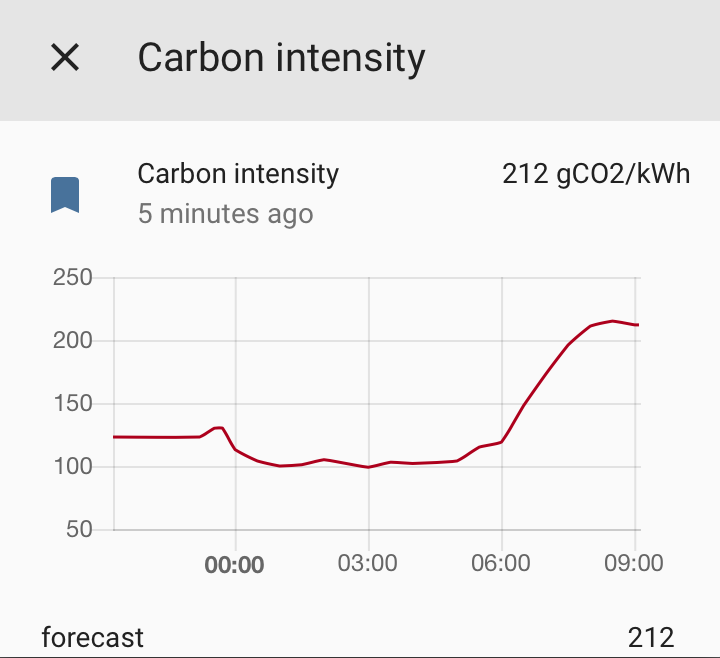

## Home Assistant Great Britain carbon insentisty componment

Adds support for the [National Grid's Carbon Intensity API](http://carbonintensity.org.uk).
The carbon intensity forecast gives an indication of the CO2 emissions related to electricity generation in Great Britain.
This component potentially allows Home Assistant to schedule jobs to minimise emissions.

